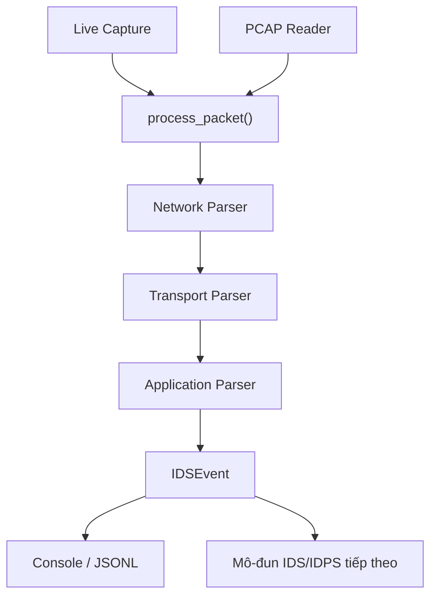

# NT204 – Xây dựng hệ thống IDS/IDPS theo mô-đun


## Giới thiệu

Repository này được sử dụng để xây dựng một hệ thống IDS/IDPS theo kiến trúc mô-đun.

Assignment 01 xây dựng nền tảng thu thập và phân tích packet, gồm:

- Bắt packet trực tiếp từ network interface.
- Đọc và xử lý packet từ file PCAP.
- Phân tích các giao thức IPv4, TCP và UDP.
- Nhận diện HTTP/1.x, DNS và SMTP.
- Chuẩn hóa kết quả thành IDS event.
- Ghi kết quả theo định dạng JSON Lines.
- Xử lý an toàn giao thức chưa hỗ trợ và packet malformed.

## Kiến trúc hệ thống

Hệ thống sử dụng một pipeline chung cho cả hai nguồn dữ liệu:



Hai chế độ đầu vào chỉ thực hiện nhiệm vụ thu thập packet. Mọi packet sau đó đều được chuyển vào `process_packet()` để sử dụng chung các parser và tạo cùng một cấu trúc event.

### Các lớp chính

| Lớp | Chức năng |
|---|---|
| Capture | Thu thập packet từ network interface hoặc file PCAP |
| Core | Điều phối pipeline và định nghĩa cấu trúc `IDSEvent` |
| Network parser | Phân tích thông tin tầng mạng, hiện hỗ trợ IPv4 |
| Transport parser | Phân tích TCP và UDP |
| Application parser | Nhận diện HTTP/1.x, DNS và SMTP |
| Output | In event ra console và ghi kết quả JSONL |
| Detection modules | Sẽ được bổ sung trong các assignment tiếp theo |


## Cấu trúc thư mục

```text
NT204.R11.ANTN_LePhamKhanhLinh_24520959/
├── ids/
│   ├── capture/
│   │   ├── __init__.py
│   │   ├── live_capture.py
│   │   └── pcap_reader.py
│   │
│   ├── core/
│   │   ├── __init__.py
│   │   ├── event.py
│   │   └── pipeline.py
│   │
│   └── parsers/
│       ├── network/
│       │   └── ipv4.py
│       ├── transport/
│       │   ├── tcp.py
│       │   └── udp.py
│       └── application/
│           ├── http.py
│           ├── dns.py
│           └── smtp.py
│
├── TEST/
│   ├── README.md
│   ├── assignment_01/
│   │   ├── README.md
│   │   ├── test_00_live_capture/
│   │   ├── test_01_tcp_handshake/
│   │   ├── test_02_tcp_payload/
│   │   ├── test_03_udp_packet/
│   │   ├── test_04_http_get/
│   │   ├── test_05_http_post/
│   │   ├── test_06_http_response/
│   │   ├── test_07_dns_query/
│   │   ├── test_08_dns_response/
│   │   ├── test_09_smtp_command/
│   │   ├── test_10_smtp_response/
│   │   ├── test_11_unknown_protocol/
│   │   └── test_12_malformed_packet/
│   │
│   ├── assignment_02/
│   │   └── README.md
│   └── assignment_03/
│       └── README.md
│
├── output/
├── .gitignore
├── main.py
├── README.md
└── requirements.txt
```

Các file `__init__.py` và một số file hỗ trợ có thể được lược bỏ trong sơ đồ để cấu trúc dễ đọc hơn.

### Quy ước thư mục kiểm thử

Mỗi test case có thể chứa:

```text
test_xx_ten_test/
├── README.md
├── input.pcap
├── result.jsonl
└── console.txt
```

Trong đó:

- `README.md`: mô tả mục tiêu, nguồn dữ liệu, cách chạy và kết quả.
- `input.pcap`: dữ liệu đầu vào của test PCAP.
- `result.jsonl`: các event do chương trình tạo ra.
- `console.txt`: output trên terminal khi chạy test.


## Yêu cầu môi trường

- Windows 10 hoặc Windows 11.
- Python 3.
- Visual Studio Code.
- Git.
- Npcap để bắt packet trực tiếp trên Windows.
- Scapy và các thư viện trong `requirements.txt`.

Kiểm tra phiên bản:

```powershell
python --version
git --version
code --version
```

## Cài đặt

### 1. Clone repository

```powershell
git clone https://github.com/lyns184/NT204.R11.ANTN_LePhamKhanhLinh_24520959.git
```

```powershell
cd NT204.R11.ANTN_LePhamKhanhLinh_24520959
```

### 2. Tạo virtual environment

```powershell
py -m venv .venv
```

### 3. Kích hoạt virtual environment

```powershell
.\.venv\Scripts\Activate.ps1
```

Khi kích hoạt thành công, terminal sẽ hiển thị:

```text
(.venv) PS ...
```

### 4. Cài đặt thư viện

```powershell
python -m pip install --upgrade pip
pip install -r requirements.txt
```

Kiểm tra Scapy:

```powershell
python -c "import scapy; print(scapy.__version__)"
```

## Cách sử dụng

Xem toàn bộ tùy chọn:

```powershell
python main.py --help
```

Chương trình yêu cầu chọn một trong hai nguồn dữ liệu:

- `--interface`: bắt packet trực tiếp.
- `--pcap`: đọc packet từ file PCAP.

### Liệt kê network interface

```powershell
python -c "from scapy.all import conf; conf.ifaces.show()"
```

### Live capture

Bắt 5 packet từ Wi-Fi:

```powershell
python -X utf8 main.py `
  --interface "Wi-Fi" `
  --count 5
```

Bắt packet và ghi kết quả JSONL:

```powershell
python -X utf8 main.py `
  --interface "Wi-Fi" `
  --count 5 `
  --output output\live_events.jsonl
```

Nếu `--count 0` được sử dụng, chương trình sẽ tiếp tục bắt packet cho đến khi người dùng nhấn `Ctrl+C`.

### Đọc file PCAP

```powershell
python -X utf8 main.py `
  --pcap TEST\assignment_01\test_01_tcp_handshake\input.pcap
```

Đọc PCAP và ghi kết quả:

```powershell
python -X utf8 main.py `
  --pcap TEST\assignment_01\test_01_tcp_handshake\input.pcap `
  --output output\pcap_events.jsonl
```

### Lưu đồng thời console và JSONL

```powershell
python -X utf8 main.py `
  --pcap TEST\assignment_01\test_01_tcp_handshake\input.pcap `
  --output output\events.jsonl |
  Tee-Object -FilePath output\console.txt
```

## Các giao thức đang hỗ trợ

| Tầng | Giao thức | Thông tin được phân tích |
|---|---|---|
| Network | IPv4 | Version, header length, total length, flags, TTL, protocol, checksum, source IP và destination IP |
| Transport | TCP | Port, sequence number, acknowledgment number, flags, window, checksum và payload length |
| Transport | UDP | Port, length, checksum và payload length |
| Application | HTTP/1.x | Request, response, method, path, status code, header và body |
| Application | DNS | Query, response, domain, query type và answer |
| Application | SMTP | Command, argument, response code và response message |

Việc nhận diện giao thức ứng dụng dựa trên đặc điểm của payload, không chỉ dựa vào số hiệu port.

## Cấu trúc IDS event

Mỗi packet được chuyển thành một event chuẩn hóa:

```json
{
  "packet_id": 1,
  "timestamp": 1789926708.428047,
  "capture_source": "interface:Wi-Fi",
  "network": {
    "protocol": "IPv4",
    "src_ip": "192.168.1.115",
    "dst_ip": "172.64.155.209"
  },
  "transport": {
    "protocol": "TCP",
    "src_port": 64426,
    "dst_port": 443,
    "flags": "S"
  },
  "application": {
    "protocol": "UNKNOWN",
    "fields": {}
  },
  "payload_length": 0,
  "parse_errors": []
}
```

Ý nghĩa một số trường:

- `packet_id`: số thứ tự packet.
- `timestamp`: thời điểm packet được ghi nhận.
- `capture_source`: nguồn packet, gồm `interface:` hoặc `pcap:`.
- `network`: thông tin tầng mạng.
- `transport`: thông tin tầng giao vận.
- `application`: giao thức và dữ liệu tầng ứng dụng.
- `payload_length`: độ dài dữ liệu.
- `parse_errors`: các lỗi được ghi nhận trong quá trình phân tích.

Giao thức chưa được hỗ trợ được chuẩn hóa thành `UNKNOWN` thay vì làm chương trình bị dừng.


## Hạn chế hiện tại

Phiên bản hiện tại là nền tảng Packet Capture & Parser, chưa phải hệ thống IDPS hoàn chỉnh.
Các hạn chế này sẽ được xử lý tùy theo yêu cầu của các assignment tiếp theo.

## Sử dụng công cụ AI

Trong quá trình thực hiện, công cụ AI được sử dụng để hỗ trợ:

- Giải thích yêu cầu kỹ thuật.
- Đề xuất cách tổ chức dự án theo mô-đun.
- Tham khảo cách sử dụng Python, Scapy và Git.
- Gợi ý câu lệnh kiểm thử.
- Hỗ trợ rà soát lỗi và tài liệu hóa.
- Đề xuất các trường hợp kiểm thử.
