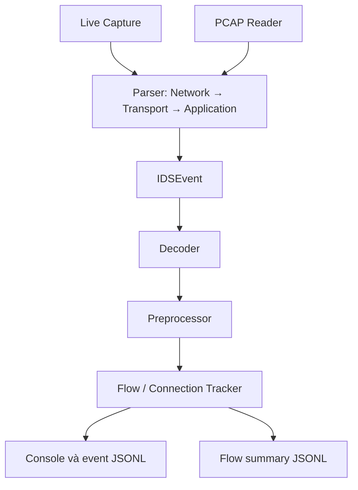

# NT204 – Xây dựng hệ thống IDS/IDPS theo mô-đun

## Giới thiệu

Repository phục vụ môn học NT204, xây dựng hệ thống IDS/IDPS theo kiến trúc mô-đun. Project hiện có các chức năng thu thập packet, phân tích giao thức, giải mã dữ liệu ứng dụng, tiền xử lý và theo dõi flow/kết nối.

**Assignment 01 – Packet Capture & Parser:**
,
- Bắt packet trực tiếp từ network interface hoặc đọc từ file PCAP.
- Phân tích IPv4, TCP và UDP; nhận diện HTTP/1.x, DNS và SMTP.
- Tạo `IDSEvent`, ghi thông tin phân tích và lỗi theo định dạng JSON Lines.
- Xử lý packet malformed và giao thức chưa hỗ trợ để tiếp tục với packet phía sau.

**Assignment 02 – Decoder, Preprocessor & Flow/Connection Tracker:**

- Giải mã HTTP URI, form, HTML entity và text theo charset; giải mã SMTP MIME Base64/Quoted-Printable.
- Kiểm tra tính hợp lệ của event, chuẩn hóa protocol/header/domain và bổ sung field tùy chọn bị thiếu.
- Gom packet hai chiều vào cùng flow, theo dõi TCP handshake, FIN/ACK, RST và idle timeout.
- Thống kê packet, byte, TCP flags và thời gian của flow; xuất flow summary riêng.


## Kiến trúc hệ thống

Hai nguồn dữ liệu dùng chung pipeline xử lý:


```mermaid
flowchart TD
    A[Live Capture] --> C[Parser: Network → Transport → Application]
    B[PCAP Reader] --> C
    C --> D[IDSEvent]
    D --> E[Decoder]
    E --> F[Preprocessor]
    F --> G[Flow / Connection Tracker]
    G --> H[Console và event JSONL]
    G --> I[Flow summary JSONL]
```

`process_packet()` điều phối các bước Parser, Decoder, Preprocessor và Flow Tracker. Kết quả phân tích gốc, kết quả giải mã và dữ liệu chuẩn hóa được giữ riêng trong event để có thể đối chiếu.

### Các lớp chính

| Lớp | Chức năng |
|---|---|
| Capture | Thu thập packet từ interface hoặc đọc PCAP |
| Core | Định nghĩa `IDSEvent`, cấu hình và điều phối pipeline |
| Network parser | Phân tích IPv4 |
| Transport parser | Phân tích TCP và UDP |
| Application parser | Nhận diện và phân tích HTTP/1.x, DNS, SMTP |
| Decoder | Giải mã dữ liệu ứng dụng, ghi status và lỗi |
| Preprocessor | Validation, normalization, bổ sung field thiếu và quyết định process/skip |
| Flow Tracker | Gom flow hai chiều, theo dõi trạng thái và thống kê |
| Output | Ghi event và flow summary vào hai file JSONL riêng |

## Cấu trúc thư mục

```text
NT204.R11.ANTN_LePhamKhanhLinh_24520959/
├── ids/
│   ├── capture/              # Live capture và PCAP reader
│   ├── core/                 # Event, config và pipeline
│   ├── parsers/
│   │   ├── network/          # IPv4
│   │   ├── transport/        # TCP, UDP
│   │   └── application/      # HTTP, DNS, SMTP và detector
│   ├── decoder/              # HTTP, text, HTML, SMTP DATA và MIME
│   ├── preprocessor/         # Validation, normalization và policy
│   ├── flow_tracker/         # Identity, TCP state, statistics và tracker
│   └── output/               # JSONL writer
├── TEST/
│   ├── README.md
│   ├── assignment_01/        # Live capture và 12 nhóm test offline
│   ├── assignment_02/        # T01–T14 và hồ sơ kết quả
│   └── assignment_03/        # Chưa triển khai
├── .gitignore
├── main.py                   # CLI
├── README.md
└── requirements.txt
```

Sơ đồ lược bỏ các file `__init__.py` và chi tiết từng test để dễ đọc.

### Quy ước thư mục kiểm thử

Một test dùng PCAP thường có:

```text
test_xx_ten_test/
├── README.md
├── input.pcap
├── result.jsonl
├── console.txt
└── result_flows.jsonl        # Khi test cần kiểm tra flow summary
```

- `README.md`: mục tiêu, dữ liệu đầu vào, cách chạy, kết quả và giải thích.
- `input.pcap`: packet đầu vào, có ghi rõ nguồn dữ liệu.
- `result.jsonl`: một event cho mỗi packet được xử lý.
- `result_flows.jsonl`: thống kê flow; dùng cho các test Flow Tracker.
- `console.txt`: output khi chạy chương trình và kiểm tra.

Một số test có thêm script `check_*.py` để tự đối chiếu kết quả hoặc tạo event trực tiếp trong bộ nhớ. T06 chỉ kiểm tra event trực tiếp nên không có PCAP; T14 lưu thêm `direct_result.jsonl`. Những event này được phân biệt rõ với packet trong PCAP ở README từng test.

## Yêu cầu môi trường

- Python **3.10 trở lên**.
- Scapy **2.7.0**, được khai báo trong `requirements.txt`.
- Git để clone repository.
- Trên Windows: Npcap để live capture; quyền truy cập interface phù hợp.

Project được phát triển và kiểm thử trên Windows với PowerShell. Các lệnh bên dưới dùng môi trường này; Visual Studio Code là công cụ biên tập tùy chọn.

## Cài đặt

### 1. Clone repository

```powershell
git clone https://github.com/lyns184/NT204.R11.ANTN_LePhamKhanhLinh_24520959.git
cd NT204.R11.ANTN_LePhamKhanhLinh_24520959
```

### 2. Tạo virtual environment

```powershell
py -m venv .venv
```

### 3. Kích hoạt virtual environment

```powershell
.\.venv\Scripts\Activate.ps1
```

Các lệnh `python` tiếp theo dùng Python trong virtual environment đã kích hoạt. Có thể gọi trực tiếp `.\.venv\Scripts\python.exe` nếu không kích hoạt.

### 4. Cài đặt thư viện

```powershell
python -m pip install -r requirements.txt
python -c "import scapy; print(scapy.__version__)"
```

## Cách sử dụng

Chạy các lệnh tại thư mục gốc project. Xem tùy chọn CLI:

```powershell
python main.py --help
```

Chọn một trong hai nguồn: `--interface` để live capture hoặc `--pcap` để đọc file. Chương trình ghi event và flow summary vào hai file riêng.

### Liệt kê network interface

```powershell
python -c "from scapy.all import show_interfaces; show_interfaces()"
```

### Live capture

Thay `Wi-Fi` bằng interface trên máy của bạn:

```powershell
python -X utf8 main.py `
  --interface "Wi-Fi" `
  --count 5 `
  --output output\live_events.jsonl `
  --flow-output output\live_flows.jsonl
```

`--count 0` (mặc định) bắt liên tục cho đến khi nhấn `Ctrl+C`. Live capture kiểm tra idle timeout cả khi không có packet mới.

### Đọc file PCAP

Ví dụ kiểm tra HTTP URL decoding bằng fixture T01:

```powershell
python -X utf8 main.py `
  --pcap TEST\assignment_02\test_01_http_url_decode\input.pcap `
  --output output\t01_events.jsonl `
  --flow-output output\t01_flows.jsonl
```

Để chạy fixture bài 1, thay đường dẫn PCAP bằng `TEST\assignment_01\test_01_tcp_handshake\input.pcap`.

### Cấu hình Flow Tracker

| Tùy chọn | Mặc định | Ý nghĩa |
|---|---|---|
| `--tcp-idle-timeout` | `300` | Thời gian im lặng để TCP flow hết hạn, tính bằng giây |
| `--udp-idle-timeout` | `60` | Thời gian im lặng để UDP flow hết hạn, tính bằng giây |
| `--flow-check-interval` | `1` | Chu kỳ kiểm tra timeout trong live capture, tính bằng giây |
| `--max-active-flows` | `10000` | Giới hạn số flow đang theo dõi |
| `--output` | `output/events.jsonl` | File event |
| `--flow-output` | Cạnh file event, hậu tố `_flows` | File flow summary |

Ví dụ `--output output\events.jsonl` sẽ tạo flow output mặc định là `output\events_flows.jsonl`. Offline PCAP dùng timestamp packet để tính timeout, không cần chờ theo thời gian thật.

### Lưu đồng thời console và JSONL

```powershell
[Console]::OutputEncoding = [System.Text.UTF8Encoding]::new($false)
$OutputEncoding = [Console]::OutputEncoding
New-Item -ItemType Directory -Force output | Out-Null

$runConsole = & python -X utf8 main.py `
  --pcap TEST\assignment_02\test_01_http_url_decode\input.pcap `
  --output output\events.jsonl `
  --flow-output output\flows.jsonl 2>&1
$runExitCode = $LASTEXITCODE
$runConsole | Set-Content -Encoding UTF8 output\console.txt
$runConsole
if ($runExitCode -ne 0) { throw "Execution failed: exit code $runExitCode" }
```

## Các giao thức đang hỗ trợ

| Tầng | Giao thức | Thông tin được phân tích |
|---|---|---|
| Network | IPv4 | Độ dài header/packet, flags, TTL, checksum, IP nguồn/đích |
| Transport | TCP | Port, sequence/acknowledgment, flags, window, checksum, payload length |
| Transport | UDP | Port, length, checksum, payload length |
| Application | HTTP/1.x | Request/response, method, path, status code, header, body |
| Application | DNS | Query/response, transaction ID, questions và answers theo loại record |
| Application | SMTP | Command, argument, response code/message |

Nhận diện ứng dụng sử dụng cấu trúc payload và thông tin giao thức/port tùy trường hợp. SMTP DATA được Decoder theo dõi theo phiên để giải mã MIME; Parser không phân tích DATA như command/response.

## Cấu trúc IDS event

JSONL chứa một JSON độc lập trên mỗi dòng. Ví dụ rút gọn từ packet HTTP của T01, lược bỏ các field header và metadata phụ:

```json
{
  "packet_id": 4,
  "timestamp": 1700000000.3,
  "network": {"protocol": "IPv4", "src_ip": "10.0.0.1", "dst_ip": "10.0.0.2"},
  "transport": {"protocol": "TCP", "src_port": 12345, "dst_port": 80},
  "application": {"protocol": "HTTP", "fields": {"method": "GET", "path": "/search?q=hello%20world"}},
  "decoded": {"http": {"uri": {"value": "/search?q=hello world", "status": "ok", "errors": []}}},
  "decode_status": "ok",
  "preprocess_status": "valid",
  "processing_action": "process",
  "reason": null,
  "direction": "forward",
  "flow_tracking_status": "tracked"
}
```

Các nhóm field trong event đầy đủ:

| Field | Ý nghĩa |
|---|---|
| `packet_id`, `timestamp`, `capture_source` | Thứ tự, thời điểm và nguồn packet |
| `network`, `transport`, `application` | Kết quả Parser |
| `payload_length`, `packet_length` | Độ dài payload và độ dài packet nếu đã thu thập; field chưa có có thể là `null` |
| `parse_errors` | Lỗi phân tích |
| `decoded`, `decode_status`, `decode_errors` | Kết quả giải mã, trạng thái và lỗi Decoder |
| `normalized` | Bản chuẩn hóa riêng; giữ dữ liệu Parser/Decoder gốc |
| `preprocess_status`, `processing_action`, `reason` | Kết quả validation và quyết định xử lý |
| `flow_id`, `direction` | ID flow và chiều packet |
| `flow_tracking_status`, `flow_tracking_reason` | Kết quả theo dõi flow |


### Flow summary

File flow summary lưu thống kê của flow khi đóng, hết hạn hoặc kết thúc capture:

- `endpoint_a`, `endpoint_b`: hai đầu IP/port; A là phía gửi packet đầu tiên được quan sát.
- `flow_id`: liên kết summary với các event của flow; ID được tạo mới mỗi lần tạo flow.
- `forward`: A→B; `backward`: B→A. Hai chiều dùng cùng flow ID.
- `packet_count`, `byte_count`: tổng số packet và byte; thống kê từng chiều nằm trong `forward`/`backward`.
- `start_time`, `last_seen`, `duration`: thời điểm đầu/cuối và khoảng thời gian giữa chúng.
- `state`, `tcp_flags`, `handshake_observed`, `capture_midstream`: metadata TCP; là `null` với UDP.
- `close_reason`: lý do xuất summary, ví dụ `tcp_fin`, `tcp_reset`, `idle_timeout`, `capture_end`.


## Hạn chế hiện tại

- Chưa có detection/rule engine, cảnh báo tấn công hoặc chức năng chặn traffic.
- Parser hiện hỗ trợ IPv4/TCP/UDP; chưa hỗ trợ IPv6 và các giao thức mạng khác.
- HTTP cần message/body đầy đủ trong packet; chưa có HTTP stream reassembly tổng quát, chunked decoding, gzip hoặc giải mã HTTPS/TLS.
- SMTP DATA có xử lý theo phiên và kiểm tra sequence trong phạm vi triển khai; chưa phải cơ chế TCP reassembly tổng quát.
- Kết quả test xác nhận những trường hợp được mô tả trong hồ sơ, chưa bao phủ mọi biến thể traffic thực tế.
- Lỗi của một packet/event được ghi nhận để tiếp tục xử lý; lỗi đọc file PCAP khiến không thể tiếp tục đọc được báo thất bại.

## Sử dụng công cụ AI

Trong quá trình thực hiện, công cụ AI được sử dụng để hỗ trợ:

- Giải thích yêu cầu kỹ thuật và đề xuất kiến trúc mô-đun.
- Hỗ trợ viết, chỉnh sửa và rà soát code.
- Đề xuất trường hợp kiểm thử, tạo fixture và script kiểm tra.
- Hỗ trợ chạy test, phân tích kết quả và xử lý lỗi.
- Giải thích Python, Scapy, Git và cấu trúc dữ liệu của project.
- Hỗ trợ viết tài liệu và câu lệnh commit.

Dữ liệu tự tạo, event giả lập và kết quả kiểm tra được ghi rõ trong README từng test để người đọc có thể đối chiếu và tái hiện.
